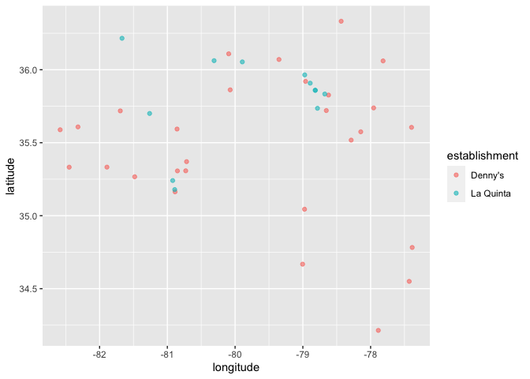

Lab 04 - La Quinta is Spanish for next to Denny’s, Pt. 1
================
Lindsay Stall
1/25/2023

### Load packages and data

``` r
library(tidyverse) 
library(dsbox) 
```

``` r
states <- read_csv("data/states.csv")
```

### Exercise 1

``` r
nrow(dennys)
```

    ## [1] 1643

``` r
ncol(dennys)
```

    ## [1] 6

There are 6 columns and 1643 rows. Each row represents a Denny’s
location. The variables are address, city, state, zip, longitude, and
latitude.

### Exercise 2

``` r
view(laquinta)
```

There are 6 columns and 909 rows. Each row represents a La Quinta
location. The variables are address, city, state, zip, longitude, and
latitude.

### Exercise 3

La Quinta appears to have locations in Canada, Mexico, China, New
Zealand, the UAE, Turkey, Chile, and Colombia.

The Denny’s store locator may not be working (not seeing any dots on the
map appear). When I search for locations in Mexico and Canada on their
site, there are no results. Perhaps they only have location in the US?

### Exercise 4

Perhaps one way to filter out data that is not from the United States is
exclude any data that does not a the initials of a state (and DC)
located in the United States. I’m not familiar with zip code
conventions, but perhaps there are specific conventions for zip code in
the US that would differentiate them from zip codes from other
countries. I’m also not super familiar with longitude and latitude, but
perhaps there would be a range of values that would cover the US, and
you could exlude any locations with longitude or latitudes outside of
said range.

### Exercise 5

``` r
dennys %>%
  filter(!(state %in% states$abbreviation))
```

    ## # A tibble: 0 × 6
    ## # … with 6 variables: address <chr>, city <chr>, state <chr>, zip <chr>,
    ## #   longitude <dbl>, latitude <dbl>

There are no states are outside the US for Dennys

### Exercise 6

``` r
dennys %>%
  mutate(country = "United States")
```

    ## # A tibble: 1,643 × 7
    ##    address                        city       state zip   longi…¹ latit…² country
    ##    <chr>                          <chr>      <chr> <chr>   <dbl>   <dbl> <chr>  
    ##  1 2900 Denali                    Anchorage  AK    99503  -150.     61.2 United…
    ##  2 3850 Debarr Road               Anchorage  AK    99508  -150.     61.2 United…
    ##  3 1929 Airport Way               Fairbanks  AK    99701  -148.     64.8 United…
    ##  4 230 Connector Dr               Auburn     AL    36849   -85.5    32.6 United…
    ##  5 224 Daniel Payne Drive N       Birmingham AL    35207   -86.8    33.6 United…
    ##  6 900 16th St S, Commons on Gree Birmingham AL    35294   -86.8    33.5 United…
    ##  7 5931 Alabama Highway, #157     Cullman    AL    35056   -86.9    34.2 United…
    ##  8 2190 Ross Clark Circle         Dothan     AL    36301   -85.4    31.2 United…
    ##  9 900 Tyson Rd                   Hope Hull… AL    36043   -86.4    32.2 United…
    ## 10 4874 University Drive          Huntsville AL    35816   -86.7    34.7 United…
    ## # … with 1,633 more rows, and abbreviated variable names ¹​longitude, ²​latitude

### Exercise 7

``` r
laquinta %>%
  filter(!(state %in% states$abbreviation))
```

    ## # A tibble: 14 × 6
    ##    address                                     city  state zip   longi…¹ latit…²
    ##    <chr>                                       <chr> <chr> <chr>   <dbl>   <dbl>
    ##  1 Carretera Panamericana Sur KM 12            "\nA… AG    20345  -102.    21.8 
    ##  2 Av. Tulum Mza. 14 S.M. 4 Lote 2             "\nC… QR    77500   -86.8   21.2 
    ##  3 Ejercito Nacional 8211                      "Col… CH    32528  -106.    31.7 
    ##  4 Blvd. Aeropuerto 4001                       "Par… NL    66600  -100.    25.8 
    ##  5 Carrera 38 # 26-13 Avenida las Palmas con … "\nM… ANT   0500…   -75.6    6.22
    ##  6 AV. PINO SUAREZ No. 1001                    "Col… NL    64000  -100.    25.7 
    ##  7 Av. Fidel Velazquez #3000 Col. Central      "\nM… NL    64190  -100.    25.7 
    ##  8 63 King Street East                         "\nO… ON    L1H1…   -78.9   43.9 
    ##  9 Calle Las Torres-1 Colonia Reforma          "\nP… VE    93210   -97.4   20.6 
    ## 10 Blvd. Audi N. 3 Ciudad Modelo               "\nS… PU    75010   -97.8   19.2 
    ## 11 Ave. Zeta del Cochero No 407                "Col… PU    72810   -98.2   19.0 
    ## 12 Av. Benito Juarez 1230 B (Carretera 57) Co… "\nS… SL    78399  -101.    22.1 
    ## 13 Blvd. Fuerza Armadas                        "con… FM    11101   -87.2   14.1 
    ## 14 8640 Alexandra Rd                           "\nR… BC    V6X1…  -123.    49.2 
    ## # … with abbreviated variable names ¹​longitude, ²​latitude

There are La Quintas in the US, Canada, Colombia, Honduras, and Mexico.

### Exercise 8

``` r
laquinta <- laquinta %>%
  mutate(country = case_when(
    state %in% state.abb     ~ "United States",
    state %in% c("ON", "BC") ~ "Canada",
    state == "ANT"           ~ "Colombia",
    state == "FM"            ~ "Honduras",
    state %in% c("AG", "QR", "CH", "NL", "VE", "PU", "SL") ~ "Mexico"
  ))
```

``` r
laquinta %>%
  filter(country == "United States")
```

    ## # A tibble: 895 × 7
    ##    address                         city      state zip   longi…¹ latit…² country
    ##    <chr>                           <chr>     <chr> <chr>   <dbl>   <dbl> <chr>  
    ##  1 793 W. Bel Air Avenue           "\nAberd… MD    21001   -76.2    39.5 United…
    ##  2 3018 CatClaw Dr                 "\nAbile… TX    79606   -99.8    32.4 United…
    ##  3 3501 West Lake Rd               "\nAbile… TX    79601   -99.7    32.5 United…
    ##  4 184 North Point Way             "\nAcwor… GA    30102   -84.7    34.1 United…
    ##  5 2828 East Arlington Street      "\nAda"   OK    74820   -96.6    34.8 United…
    ##  6 14925 Landmark Blvd             "\nAddis… TX    75254   -96.8    33.0 United…
    ##  7 909 East Frontage Rd            "\nAlamo" TX    78516   -98.1    26.2 United…
    ##  8 2116 Yale Blvd Southeast        "\nAlbuq… NM    87106  -107.     35.1 United…
    ##  9 7439 Pan American Fwy Northeast "\nAlbuq… NM    87109  -107.     35.2 United…
    ## 10 2011 Menaul Blvd Northeast      "\nAlbuq… NM    87107  -107.     35.1 United…
    ## # … with 885 more rows, and abbreviated variable names ¹​longitude, ²​latitude

### Exercise 9

``` r
dennys %>%
  count(state) %>%
  inner_join(states, by = c("state" = "abbreviation"))
```

    ## # A tibble: 51 × 4
    ##    state     n name                     area
    ##    <chr> <int> <chr>                   <dbl>
    ##  1 AK        3 Alaska               665384. 
    ##  2 AL        7 Alabama               52420. 
    ##  3 AR        9 Arkansas              53179. 
    ##  4 AZ       83 Arizona              113990. 
    ##  5 CA      403 California           163695. 
    ##  6 CO       29 Colorado             104094. 
    ##  7 CT       12 Connecticut            5543. 
    ##  8 DC        2 District of Columbia     68.3
    ##  9 DE        1 Delaware               2489. 
    ## 10 FL      140 Florida               65758. 
    ## # … with 41 more rows

California has the most Denny’s (403). Delaware has the fewest Denny’s
(1).

``` r
laquinta %>%
  count(state) %>%
  inner_join(states, by = c("state" = "abbreviation"))
```

    ## # A tibble: 48 × 4
    ##    state     n name           area
    ##    <chr> <int> <chr>         <dbl>
    ##  1 AK        2 Alaska      665384.
    ##  2 AL       16 Alabama      52420.
    ##  3 AR       13 Arkansas     53179.
    ##  4 AZ       18 Arizona     113990.
    ##  5 CA       56 California  163695.
    ##  6 CO       27 Colorado    104094.
    ##  7 CT        6 Connecticut   5543.
    ##  8 FL       74 Florida      65758.
    ##  9 GA       41 Georgia      59425.
    ## 10 IA        4 Iowa         56273.
    ## # … with 38 more rows

Texas has the most La Quintas (237). Maine has the fewest La Quintas
(1).

This data is not particularly suprising; CA and TX are large states so
their higher rates of Denny’s and La Quinta’s makes sense.

### Exercise 10

``` r
dennys %>%
  count(state) %>%
  inner_join(states, by = c("state" = "abbreviation"))%>%
  mutate(dennysper1000 = n / area * 1000)%>%
  arrange(dennysper1000)
```

    ## # A tibble: 51 × 5
    ##    state     n name            area dennysper1000
    ##    <chr> <int> <chr>          <dbl>         <dbl>
    ##  1 AK        3 Alaska       665384.       0.00451
    ##  2 MT        4 Montana      147040.       0.0272 
    ##  3 SD        3 South Dakota  77116.       0.0389 
    ##  4 WY        4 Wyoming       97813.       0.0409 
    ##  5 IA        3 Iowa          56273.       0.0533 
    ##  6 ND        4 North Dakota  70698.       0.0566 
    ##  7 NE        5 Nebraska      77348.       0.0646 
    ##  8 LA        4 Louisiana     52378.       0.0764 
    ##  9 KS        8 Kansas        82278.       0.0972 
    ## 10 MS        5 Mississippi   48432.       0.103  
    ## # … with 41 more rows

DC has the most denny’s/1000 sq mile

``` r
laquinta %>%
  count(state) %>%
  inner_join(states, by = c("state" = "abbreviation"))%>%
  mutate(laquintaper1000 = n / area * 1000)%>%
  arrange(laquintaper1000)
```

    ## # A tibble: 48 × 5
    ##    state     n name            area laquintaper1000
    ##    <chr> <int> <chr>          <dbl>           <dbl>
    ##  1 AK        2 Alaska       665384.         0.00301
    ##  2 SD        2 South Dakota  77116.         0.0259 
    ##  3 ME        1 Maine         35380.         0.0283 
    ##  4 WY        3 Wyoming       97813.         0.0307 
    ##  5 MI        4 Michigan      96714.         0.0414 
    ##  6 MT        9 Montana      147040.         0.0612 
    ##  7 NE        5 Nebraska      77348.         0.0646 
    ##  8 ND        5 North Dakota  70698.         0.0707 
    ##  9 IA        4 Iowa          56273.         0.0711 
    ## 10 NV        8 Nevada       110572.         0.0724 
    ## # … with 38 more rows

Rhode Island has the most la quinta’s between 1000 sq miles.

``` r
dennys <- dennys %>%
  mutate(establishment = "Denny's")
laquinta <- laquinta %>%
  mutate(establishment = "La Quinta")
```

``` r
dennys_laquinta <- bind_rows(dennys, laquinta)
```

``` r
ggplot(dennys_laquinta, mapping = aes(x = longitude,
                            y = latitude,
                            color = establishment)) +
  geom_point()
```

<!-- -->

### Exercise 11

``` r
dennys_laquinta %>% 
filter(state == "NC") %>% 
  ggplot(dennys_laquinta, mapping = aes(x = longitude,
                            y = latitude,
                            color = establishment)) +
  geom_point(alpha = .6)
```

<!-- --> There are
certainly Denny’s and La Quintas next to eachother but its not
overwhelming.

### Exercise 12

``` r
dennys_laquinta %>% 
filter(state == "TX") %>% 
  ggplot(dennys_laquinta, mapping = aes(x = longitude,
                            y = latitude,
                            color = establishment)) +
  geom_point(alpha = .6)
```

<!-- --> This one
looks like there is almost always a La Quinta near a Denny’s. Moreso
than NC
